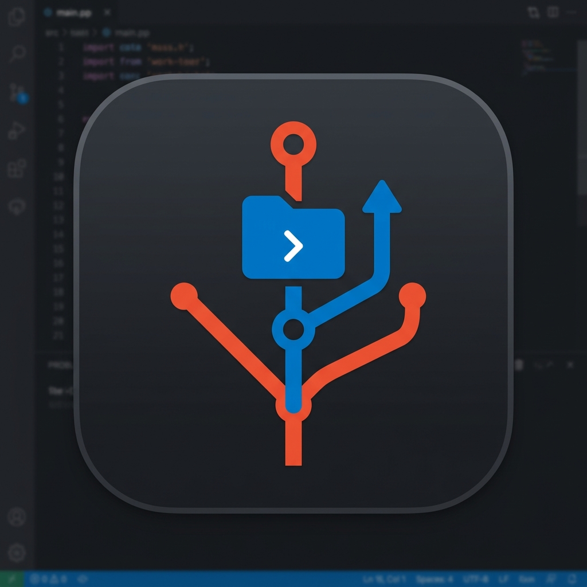

# Git Worktrees Native

  

  <strong>Native, lightning-fast Git worktree management for multi-repo workspaces.</strong>

  
  
  

## Features

- **Lightning Fast**: Built directly on top of the native VS Code Git Extension API and `git worktree` commands.
- **Multi-Repo Support**: Automatically detects all open repositories. You can select multiple repositories at once to apply a worktree to all of them simultaneously!
- **Intelligent Branch Sync**: When adding a worktree, the extension suggests branches that are already active in your other workspace repositories, making cross-repo synchronization effortless.
- **1-Click Branch Duplication**: Right-click any worktree to instantly duplicate its branch to other open repositories in your workspace.
- **Easy Management**: Add, remove, and switch between worktrees directly from the Source Control (SCM) view.
- **Visual Indicators**: Clear icons distinguishing between bare repositories, detached heads, and active branches.

## Usage

You can access Git Worktrees Native through the **Source Control (SCM)** view in the sidebar, or via the Command Palette (`Cmd+Shift+P` / `Ctrl+Shift+P`).

### Available Commands
- `Git Worktrees: Add Worktree` - Creates a new worktree and branch.
- `Git Worktrees: Duplicate to Other Repositories...` - Clones an existing worktree branch to other selected repos.
- `Git Worktrees: Remove Worktree` - Removes an existing worktree safely.
- `Git Worktrees: Switch Worktree` - Opens the selected worktree folder in the current or a new window.
- `Git Worktrees: Refresh` - Manually refreshes the worktrees list.

## Requirements

- VS Code `^1.85.0`
- Git installed and available in your system's `PATH`.

## Contributing

We welcome contributions! Please see our [Contributing Guide](CONTRIBUTING.md) for details on how to build, test, and submit pull requests.

## License

This project is licensed under the [MIT License](LICENSE).
